# Markdown Issue Index

Generated by derive-tracker.wasm

## Ready Queue

| ID | Priority | Type | Assignee | Title | Labels |
| --- | ---: | --- | --- | --- | --- |
| [ISS-152](ISS-152.md) | 1 | bug | unassigned | Encapsulate mutable MilkIR entity collections | milkir, ir, ownership, api, correctness, migration, agent |
| [ISS-171](ISS-171.md) | 1 | bug | unassigned | Validate contextual Wasm dialect contracts against module types | wasm_milkir, wasm_isa_lower, verifier, types, correctness, agent |

## Unresolved Issues

| ID | Status | Priority | Type | Assignee | Blocked by | Blocks | Title |
| --- | --- | ---: | --- | --- | --- | --- | --- |
| [ISS-152](ISS-152.md) | open | 1 | bug | unassigned | none | none | Encapsulate mutable MilkIR entity collections |
| [ISS-171](ISS-171.md) | open | 1 | bug | unassigned | none | none | Validate contextual Wasm dialect contracts against module types |

## Dependency Graph

```mermaid
graph TD
  ISS_001["ISS-001: Split Wasmoon into reusable compiler infrastructure modules"]
  ISS_002["ISS-002: Create modules workspace layout"]
  ISS_003["ISS-003: Extract wasm_core specification model"]
  ISS_004["ISS-004: Introduce MilkIR core"]
  ISS_005["ISS-005: Lower WebAssembly into MilkIR through an embedding environment"]
  ISS_006["ISS-006: Extract MachV virtual-register machine IR"]
  ISS_007["ISS-007: Extract pure regalloc module"]
  ISS_008["ISS-008: Add machv_regalloc adapter"]
  ISS_009["ISS-009: Split ISA targets for x64 and AArch64"]
  ISS_010["ISS-010: Extract machv_emit generic emitter"]
  ISS_011["ISS-011: Rehome Wasmoon JIT integration"]
  ISS_012["ISS-012: Reassemble wasmoon runtime and CLI package"]
  ISS_013["ISS-013: Validate first-stage split and document remaining gaps"]
  ISS_014["ISS-014: Migrate compiler infrastructure into reusable modules"]
  ISS_015["ISS-015: Replace MilkIR skeleton with real generic IR core"]
  ISS_016["ISS-016: Migrate WebAssembly frontend lowering onto MilkIR"]
  ISS_017["ISS-017: Port IR optimizations and egraph passes to MilkIR"]
  ISS_018["ISS-018: Migrate VCode data model into MachV"]
  ISS_019["ISS-019: Move real instruction selection and ABI policy into ISA targets"]
  ISS_020["ISS-020: Migrate real register allocation into regalloc and machv_regalloc"]
  ISS_021["ISS-021: Migrate real machine-code emission into machv_emit"]
  ISS_022["ISS-022: Move cwasm and native JIT glue into wasmoon_jit"]
  ISS_023["ISS-023: Retire legacy wasmoon IR and VCode implementation paths"]
  ISS_024["ISS-024: Validate real compiler-infrastructure migration"]
  ISS_025["ISS-025: Retire wasmoon_jit legacy compiler internals"]
  ISS_026["ISS-026: Complete reusable compiler infrastructure polish"]
  ISS_027["ISS-027: Stabilize reusable module public APIs"]
  ISS_028["ISS-028: Complete reusable trampoline ABI coverage"]
  ISS_029["ISS-029: Centralize the reusable VMContext embedding ABI"]
  ISS_030["ISS-030: Close native frontend lowering gaps"]
  ISS_031["ISS-031: Restore production-style JIT unit-test harness"]
  ISS_032["ISS-032: Model stack arguments and multi-value return areas in MachV ABI"]
  ISS_033["ISS-033: Fix native JIT WASI import call hang"]
  ISS_034["ISS-034: Remove native JIT interpreter fallback trampoline path"]
  ISS_035["ISS-035: Fix native JIT segment helper context execution"]
  ISS_036["ISS-036: Fix native JIT memory.grow helper hang"]
  ISS_037["ISS-037: Fix native JIT table.grow helper hang"]
  ISS_038["ISS-038: Match production JIT recursive call-depth semantics"]
  ISS_039["ISS-039: Restore AMD64 JIT-vs-interpreter correctness gate"]
  ISS_040["ISS-040: Move Wasmoon native runtime coupling out of machv_emit"]
  ISS_041["ISS-041: Remove legacy trap-immediate public API"]
  ISS_042["ISS-042: Clarify remaining legacy and fallback wording"]
  ISS_043["ISS-043: Clarify cwasm runtime-helper fixup wording"]
  ISS_044["ISS-044: Describe the interpreter as an execution engine"]
  ISS_045["ISS-045: Clarify Store C-heap ownership comments"]
  ISS_046["ISS-046: Remove legacy wording from JIT value conversion comments"]
  ISS_047["ISS-047: Reword reload coalescing allocation-path comments"]
  ISS_048["ISS-048: Clarify emitter immediate-materialization fallback wording"]
  ISS_049["ISS-049: Rename stackmap fallback root-count terminology"]
  ISS_050["ISS-050: Make regalloc the production backtracking allocator core"]
  ISS_051["ISS-051: Remove duplicate machv_regalloc unionfind"]
  ISS_052["ISS-052: Move production backtracking allocator model into regalloc"]
  ISS_053["ISS-053: Move backtracking allocation policies into regalloc"]
  ISS_054["ISS-054: Move production spill and allocation-result policies into regalloc"]
  ISS_055["ISS-055: Route production MachV allocation through regalloc backtracking engine"]
  ISS_056["ISS-056: Clarify regalloc public API after production cutover"]
  ISS_057["ISS-057: Move production bundle merging into regalloc"]
  ISS_058["ISS-058: Make MachV Function the production machine IR"]
  ISS_059["ISS-059: Remove MilkIR types from machv_regalloc machine data"]
  ISS_060["ISS-060: Move Wasmoon VMContext ABI out of MachV core"]
  ISS_061["ISS-061: Move Wasm calling-convention policy out of MachV ISA traits"]
  ISS_062["ISS-062: Remove Wasm runtime pseudo-ops from MachV instruction core"]
  ISS_063["ISS-063: Narrow machv_emit to generic emission artifacts"]
  ISS_064["ISS-064: Replace wasm_frontend to wasmoon_jit layout dependency"]
  ISS_065["ISS-065: Separate MilkIR generic core from Wasm semantic extensions"]
  ISS_066["ISS-066: Retire wasmoon_jit/ir compatibility frontend"]
  ISS_067["ISS-067: Generalize MachV call-site metadata"]
  ISS_068["ISS-068: Replace Wasm function indices in MachV call and address opcodes"]
  ISS_069["ISS-069: Remove VMContext memory-base pseudo-op from MachV instruction core"]
  ISS_070["ISS-070: Lower exact indirect type checks without a MachV Wasm pseudo-op"]
  ISS_071["ISS-071: Move subtype indirect-check slow path out of MachV instruction core"]
  ISS_072["ISS-072: Move Wasmoon GC allocation pseudo-ops out of MachV instruction core"]
  ISS_073["ISS-073: Narrow wasm frontend IR public API"]
  ISS_074["ISS-074: Replace wasm frontend translation parameter list with typed context"]
  ISS_075["ISS-075: Pass host ISA explicitly instead of detecting it in MachV"]
  ISS_076["ISS-076: Split Wasm dialect operations out of MilkIR core"]
  ISS_077["ISS-077: Move Wasm runtime-helper lowering out of milkir_machv"]
  ISS_078["ISS-078: Move VMContext and Wasmoon register roles out of MachV ISA core"]
  ISS_079["ISS-079: Narrow machv_emit to generic emission inputs"]
  ISS_080["ISS-080: Replace Wasm-body APIs in target modules with generic call-convention lowering"]
  ISS_081["ISS-081: Remove Wasmoon vocabulary from regalloc and machv_regalloc internals"]
  ISS_082["ISS-082: Minimize reusable module metadata dependencies"]
  ISS_083["ISS-083: Remove fixed runtime-context schema from reusable infrastructure"]
  ISS_084["ISS-084: Introduce generic context-slot metadata for lowering and emission"]
  ISS_085["ISS-085: Move table and context-pointer lowering behind wasm_isa_lower"]
  ISS_086["ISS-086: Make LICM and CSE consume generic memory facts"]
  ISS_087["ISS-087: Move Wasmoon debug and GC context offsets out of machv_emit"]
  ISS_088["ISS-088: Delete fixed EmbeddingContextLayout schema and compatibility alias"]
  ISS_089["ISS-089: Remove Wasm-named reference types from MilkIR core"]
  ISS_090["ISS-090: Lower Wasm GC inline allocation as explicit MachV CFG"]
  ISS_091["ISS-091: Define a stable MilkIR facade API"]
  ISS_092["ISS-092: Make FunctionBuilder construction failures explicit"]
  ISS_093["ISS-093: Replace stringly typed ExtOp with a stronger extension contract"]
  ISS_094["ISS-094: Introduce a user-facing MilkIR-to-MachV lowering configuration"]
  ISS_095["ISS-095: Document MilkIR semantics and invariants"]
  ISS_096["ISS-096: Remove Wasmoon runtime symbol alias fallback"]
  ISS_097["ISS-097: Remove machv_regalloc historical helper API"]
  ISS_098["ISS-098: Clarify machv_emit public encoder helper status"]
  ISS_099["ISS-099: Remove wasm_core FuncType compatibility extraction helper"]
  ISS_100["ISS-100: Remove legacy funcref null sentinel"]
  ISS_101["ISS-101: Remove JIT GC critical-section no-op compatibility exports"]
  ISS_102["ISS-102: Remove wasmoon-tools component wit CLI alias"]
  ISS_103["ISS-103: Refresh stale module boundary documentation"]
  ISS_104["ISS-104: Define the canonical regalloc public facade"]
  ISS_105["ISS-105: Hide backtracking allocator internals from regalloc root API"]
  ISS_106["ISS-106: Hide CFG, liveness, and planner helper APIs"]
  ISS_107["ISS-107: Narrow regalloc model mutability and field visibility"]
  ISS_108["ISS-108: Stop regalloc tests and docs from cementing internal APIs"]
  ISS_109["ISS-109: Close Wasmoon architecture integrity gaps"]
  ISS_110["ISS-110: Validate CLI run modules before instantiation"]
  ISS_111["ISS-111: Unify the production Wasm frontend entry point"]
  ISS_112["ISS-112: Classify Wasmoon JIT integration as product-owned"]
  ISS_113["ISS-113: Refresh architecture and readiness documentation"]
  ISS_119["ISS-119: Restore safe MilkIR loop unrolling"]
  ISS_120["ISS-120: Strengthen MilkIR SSA verification"]
  ISS_121["ISS-121: Fully unroll canonical constant-trip I32 loops"]
  ISS_122["ISS-122: Preserve loop-carried SSA and effects during full unrolling"]
  ISS_123["ISS-123: Add factor-two loop unrolling with remainder handling"]
  ISS_124["ISS-124: Extend checked trip-count analysis to I64 and boundary cases"]
  ISS_125["ISS-125: Enable safe O3 loop unrolling and differential validation"]
  ISS_126["ISS-126: Complete MilkIR verifier instruction contracts"]
  ISS_127["ISS-127: Preserve reference widths during MilkIR-to-MachV lowering"]
  ISS_128["ISS-128: Accept I64 pointer carriers in CallPtr verification"]
  ISS_129["ISS-129: Complete carrier-width regression matrices"]
  ISS_130["ISS-130: Define canonical Function signature construction"]
  ISS_131["ISS-131: Migrate implicit Function parameter producers"]
  ISS_132["ISS-132: Remove duplicate Function signature state"]
  ISS_133["ISS-133: Establish a semantic MilkIR opcode hierarchy"]
  ISS_134["ISS-134: Remove unsupported and untyped core opcodes"]
  ISS_135["ISS-135: Group generic memory operations under MemoryOp"]
  ISS_136["ISS-136: Group calls under a generic CallOp contract"]
  ISS_137["ISS-137: Group language-neutral vector operations under VectorOp"]
  ISS_138["ISS-138: Consume Wasm SIMD memory arguments before MilkIR core"]
  ISS_139["ISS-139: Group scalar operations under ScalarOp"]
  ISS_140["ISS-140: Separate dialect-bearing IR from core lowering"]
  ISS_141["ISS-141: Contract the legacy opcode representation"]
  ISS_142["ISS-142: Contract legacy scalar opcode forms"]
  ISS_143["ISS-143: Contract legacy vector opcode forms"]
  ISS_144["ISS-144: Remove residual opcode compatibility APIs"]
  ISS_145["ISS-145: Finalize the semantic opcode contract"]
  ISS_146["ISS-146: Restore verifier-safe tail calls and reference carriers"]
  ISS_147["ISS-147: Enforce MilkIR function ownership"]
  ISS_148["ISS-148: Make floating constants explicitly typed by bits"]
  ISS_149["ISS-149: Remove MilkIR optimization size cliffs"]
  ISS_150["ISS-150: Emit compile metrics when a run cache entry exists"]
  ISS_151["ISS-151: Reconnect MilkIR pass metrics through an embedding-neutral sink"]
  ISS_152["ISS-152: Encapsulate mutable MilkIR entity collections"]
  ISS_153["ISS-153: Remove unlowerable Wasm dialect opcodes"]
  ISS_154["ISS-154: Return typed Wasm dialect lowering errors"]
  ISS_155["ISS-155: Centralize MilkIR opcode semantic facts"]
  ISS_156["ISS-156: Derive dead-code and loop safety from opcode semantics"]
  ISS_157["ISS-157: Derive GVN memory policy from opcode semantics"]
  ISS_158["ISS-158: Derive e-graph purity and enforce opcode completeness"]
  ISS_159["ISS-159: Cover every non-pure MilkIR opcode constructor"]
  ISS_160["ISS-160: Centralize the Wasm extension wire protocol"]
  ISS_161["ISS-161: Normalize MilkIR vector operation semantics"]
  ISS_162["ISS-162: Define parameterized vector operation families"]
  ISS_163["ISS-163: Migrate vector contracts and producers"]
  ISS_164["ISS-164: Lower normalized vector operations to MachV"]
  ISS_165["ISS-165: Remove the legacy VectorOp matrix and validate SIMD parity"]
  ISS_166["ISS-166: Eliminate MoonBit warning 73 annotations"]
  ISS_167["ISS-167: Add comprehensive MilkIR black-box contract tests"]
  ISS_168["ISS-168: Separate MilkIR O1 and O2 optimization pipelines"]
  ISS_169["ISS-169: Stabilize natural-loop block ordering across backends"]
  ISS_170["ISS-170: Add cooperative cancellation safepoints to Wasm execution"]
  ISS_171["ISS-171: Validate contextual Wasm dialect contracts against module types"]
  ISS_172["ISS-172: Accept table64 indices in Wasm indirect-call contracts"]
  ISS_173["ISS-173: Preserve table index width in indirect-call address lowering"]
  ISS_002 --> ISS_003
  ISS_002 --> ISS_004
  ISS_003 --> ISS_005
  ISS_004 --> ISS_005
  ISS_002 --> ISS_006
  ISS_002 --> ISS_007
  ISS_006 --> ISS_008
  ISS_007 --> ISS_008
  ISS_004 --> ISS_009
  ISS_006 --> ISS_009
  ISS_006 --> ISS_010
  ISS_009 --> ISS_010
  ISS_005 --> ISS_011
  ISS_008 --> ISS_011
  ISS_010 --> ISS_011
  ISS_003 --> ISS_012
  ISS_005 --> ISS_012
  ISS_011 --> ISS_012
  ISS_012 --> ISS_013
  ISS_015 --> ISS_016
  ISS_015 --> ISS_017
  ISS_015 --> ISS_018
  ISS_016 --> ISS_019
  ISS_018 --> ISS_019
  ISS_018 --> ISS_020
  ISS_019 --> ISS_021
  ISS_020 --> ISS_021
  ISS_016 --> ISS_022
  ISS_021 --> ISS_022
  ISS_017 --> ISS_023
  ISS_022 --> ISS_023
  ISS_023 --> ISS_024
  ISS_028 --> ISS_027
  ISS_029 --> ISS_027
  ISS_030 --> ISS_027
  ISS_031 --> ISS_027
  ISS_032 --> ISS_028
  ISS_029 --> ISS_030
  ISS_028 --> ISS_031
  ISS_029 --> ISS_031
  ISS_033 --> ISS_031
  ISS_034 --> ISS_031
  ISS_035 --> ISS_031
  ISS_036 --> ISS_031
  ISS_037 --> ISS_031
  ISS_051 --> ISS_050
  ISS_052 --> ISS_050
  ISS_053 --> ISS_050
  ISS_054 --> ISS_050
  ISS_055 --> ISS_050
  ISS_056 --> ISS_050
  ISS_051 --> ISS_052
  ISS_052 --> ISS_053
  ISS_052 --> ISS_054
  ISS_053 --> ISS_055
  ISS_054 --> ISS_055
  ISS_055 --> ISS_056
  ISS_058 --> ISS_059
  ISS_060 --> ISS_061
  ISS_067 --> ISS_062
  ISS_068 --> ISS_062
  ISS_069 --> ISS_062
  ISS_070 --> ISS_062
  ISS_071 --> ISS_062
  ISS_072 --> ISS_062
  ISS_058 --> ISS_063
  ISS_060 --> ISS_063
  ISS_060 --> ISS_064
  ISS_064 --> ISS_065
  ISS_064 --> ISS_066
  ISS_065 --> ISS_066
  ISS_067 --> ISS_068
  ISS_068 --> ISS_069
  ISS_069 --> ISS_070
  ISS_070 --> ISS_071
  ISS_071 --> ISS_072
  ISS_066 --> ISS_073
  ISS_073 --> ISS_074
  ISS_076 --> ISS_077
  ISS_078 --> ISS_079
  ISS_078 --> ISS_080
  ISS_078 --> ISS_081
  ISS_084 --> ISS_085
  ISS_084 --> ISS_086
  ISS_084 --> ISS_087
  ISS_085 --> ISS_088
  ISS_086 --> ISS_088
  ISS_087 --> ISS_088
  ISS_104 --> ISS_105
  ISS_104 --> ISS_106
  ISS_104 --> ISS_107
  ISS_104 --> ISS_108
  ISS_105 --> ISS_108
  ISS_106 --> ISS_108
  ISS_107 --> ISS_108
  ISS_110 --> ISS_109
  ISS_111 --> ISS_109
  ISS_112 --> ISS_109
  ISS_113 --> ISS_109
  ISS_110 --> ISS_113
  ISS_111 --> ISS_113
  ISS_112 --> ISS_113
  ISS_120 --> ISS_119
  ISS_121 --> ISS_119
  ISS_122 --> ISS_119
  ISS_123 --> ISS_119
  ISS_124 --> ISS_119
  ISS_125 --> ISS_119
  ISS_120 --> ISS_121
  ISS_121 --> ISS_122
  ISS_122 --> ISS_123
  ISS_123 --> ISS_124
  ISS_124 --> ISS_125
  ISS_130 --> ISS_131
  ISS_131 --> ISS_132
  ISS_134 --> ISS_135
  ISS_134 --> ISS_136
  ISS_134 --> ISS_137
  ISS_137 --> ISS_138
  ISS_135 --> ISS_139
  ISS_136 --> ISS_139
  ISS_137 --> ISS_139
  ISS_138 --> ISS_140
  ISS_139 --> ISS_140
  ISS_140 --> ISS_141
  ISS_140 --> ISS_142
  ISS_142 --> ISS_143
  ISS_143 --> ISS_144
  ISS_144 --> ISS_145
  ISS_153 --> ISS_154
  ISS_155 --> ISS_156
  ISS_156 --> ISS_157
  ISS_157 --> ISS_158
  ISS_155 --> ISS_159
  ISS_153 --> ISS_160
  ISS_145 --> ISS_161
  ISS_155 --> ISS_161
  ISS_162 --> ISS_163
  ISS_163 --> ISS_164
  ISS_164 --> ISS_165
  ISS_166 --> ISS_167
  ISS_149 --> ISS_168
```

## Warnings

None.

