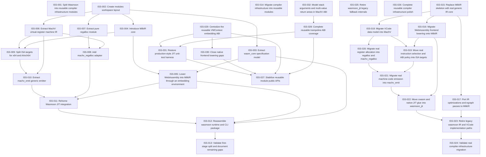

# Markdown Issue Index

Generated by derive-tracker.wasm

## Ready Queue

| ID | Priority | Type | Assignee | Title | Labels |
| --- | ---: | --- | --- | --- | --- |
| [ISS-030](ISS-030.md) | 2 | task | unassigned | Close native frontend lowering gaps | wasm_frontend, milkir, lowering, reusable-infra, correctness |

## Unresolved Issues

| ID | Status | Priority | Type | Assignee | Blocked by | Blocks | Title |
| --- | --- | ---: | --- | --- | --- | --- | --- |
| [ISS-032](ISS-032.md) | in_progress | 2 | task | unassigned | none | ISS-028 | Model stack arguments and multi-value return areas in MachV ABI |
| [ISS-027](ISS-027.md) | open | 2 | task | unassigned | ISS-028, ISS-030, ISS-031 | none | Stabilize reusable module public APIs |
| [ISS-028](ISS-028.md) | blocked | 2 | task | unassigned | ISS-032 | ISS-027, ISS-031 | Complete reusable trampoline ABI coverage |
| [ISS-030](ISS-030.md) | open | 2 | task | unassigned | none | ISS-027 | Close native frontend lowering gaps |
| [ISS-026](ISS-026.md) | deferred | 3 | epic | unassigned | none | none | Complete reusable compiler infrastructure polish |
| [ISS-031](ISS-031.md) | open | 3 | task | unassigned | ISS-028 | ISS-027 | Restore production-style JIT unit-test harness |

## Dependency Graph

## Warnings

None.

