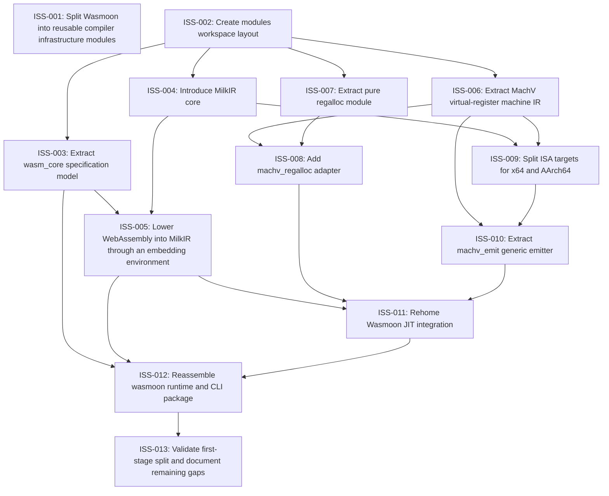

# Markdown Issue Index

Generated by derive-tracker.wasm

## Ready Queue

| ID | Priority | Type | Assignee | Title | Labels |
| --- | ---: | --- | --- | --- | --- |
| [ISS-001](ISS-001.md) | 1 | epic | unassigned | Split Wasmoon into reusable compiler infrastructure modules | architecture, migration, agent |
| [ISS-013](ISS-013.md) | 2 | task | unassigned | Validate first-stage split and document remaining gaps | validation, docs, migration, agent |

## Unresolved Issues

| ID | Status | Priority | Type | Assignee | Blocked by | Blocks | Title |
| --- | --- | ---: | --- | --- | --- | --- | --- |
| [ISS-001](ISS-001.md) | open | 1 | epic | unassigned | none | none | Split Wasmoon into reusable compiler infrastructure modules |
| [ISS-013](ISS-013.md) | open | 2 | task | unassigned | none | none | Validate first-stage split and document remaining gaps |

## Dependency Graph

## Warnings

None.

