# Markdown Issue Index

Generated by derive-tracker.wasm

## Ready Queue

| ID | Priority | Type | Assignee | Title | Labels |
| --- | ---: | --- | --- | --- | --- |
| [ISS-063](ISS-063.md) | 1 | task | unassigned | Narrow machv_emit to generic emission artifacts | machv_emit, wasmoon_jit, runtime, trampoline, architecture, migration, agent |
| [ISS-064](ISS-064.md) | 1 | task | unassigned | Replace wasm_frontend to wasmoon_jit layout dependency | wasm_frontend, wasmoon_jit, embedding, vmcontext, architecture, migration, agent |

## Unresolved Issues

| ID | Status | Priority | Type | Assignee | Blocked by | Blocks | Title |
| --- | --- | ---: | --- | --- | --- | --- | --- |
| [ISS-063](ISS-063.md) | open | 1 | task | unassigned | none | none | Narrow machv_emit to generic emission artifacts |
| [ISS-064](ISS-064.md) | open | 1 | task | unassigned | none | ISS-065, ISS-066 | Replace wasm_frontend to wasmoon_jit layout dependency |
| [ISS-065](ISS-065.md) | open | 1 | task | unassigned | ISS-064 | ISS-066 | Separate MilkIR generic core from Wasm semantic extensions |
| [ISS-066](ISS-066.md) | open | 2 | task | unassigned | ISS-064, ISS-065 | none | Retire wasmoon_jit/ir compatibility frontend |

## Dependency Graph

```mermaid
graph TD
  ISS_001["ISS-001: Split Wasmoon into reusable compiler infrastructure modules"]
  ISS_002["ISS-002: Create modules workspace layout"]
  ISS_003["ISS-003: Extract wasm_core specification model"]
  ISS_004["ISS-004: Introduce MilkIR core"]
  ISS_005["ISS-005: Lower WebAssembly into MilkIR through an embedding environment"]
  ISS_006["ISS-006: Extract MachV virtual-register machine IR"]
  ISS_007["ISS-007: Extract pure regalloc module"]
  ISS_008["ISS-008: Add machv_regalloc adapter"]
  ISS_009["ISS-009: Split ISA targets for x64 and AArch64"]
  ISS_010["ISS-010: Extract machv_emit generic emitter"]
  ISS_011["ISS-011: Rehome Wasmoon JIT integration"]
  ISS_012["ISS-012: Reassemble wasmoon runtime and CLI package"]
  ISS_013["ISS-013: Validate first-stage split and document remaining gaps"]
  ISS_014["ISS-014: Migrate compiler infrastructure into reusable modules"]
  ISS_015["ISS-015: Replace MilkIR skeleton with real generic IR core"]
  ISS_016["ISS-016: Migrate WebAssembly frontend lowering onto MilkIR"]
  ISS_017["ISS-017: Port IR optimizations and egraph passes to MilkIR"]
  ISS_018["ISS-018: Migrate VCode data model into MachV"]
  ISS_019["ISS-019: Move real instruction selection and ABI policy into ISA targets"]
  ISS_020["ISS-020: Migrate real register allocation into regalloc and machv_regalloc"]
  ISS_021["ISS-021: Migrate real machine-code emission into machv_emit"]
  ISS_022["ISS-022: Move cwasm and native JIT glue into wasmoon_jit"]
  ISS_023["ISS-023: Retire legacy wasmoon IR and VCode implementation paths"]
  ISS_024["ISS-024: Validate real compiler-infrastructure migration"]
  ISS_025["ISS-025: Retire wasmoon_jit legacy compiler internals"]
  ISS_026["ISS-026: Complete reusable compiler infrastructure polish"]
  ISS_027["ISS-027: Stabilize reusable module public APIs"]
  ISS_028["ISS-028: Complete reusable trampoline ABI coverage"]
  ISS_029["ISS-029: Centralize the reusable VMContext embedding ABI"]
  ISS_030["ISS-030: Close native frontend lowering gaps"]
  ISS_031["ISS-031: Restore production-style JIT unit-test harness"]
  ISS_032["ISS-032: Model stack arguments and multi-value return areas in MachV ABI"]
  ISS_033["ISS-033: Fix native JIT WASI import call hang"]
  ISS_034["ISS-034: Remove native JIT interpreter fallback trampoline path"]
  ISS_035["ISS-035: Fix native JIT segment helper context execution"]
  ISS_036["ISS-036: Fix native JIT memory.grow helper hang"]
  ISS_037["ISS-037: Fix native JIT table.grow helper hang"]
  ISS_038["ISS-038: Match production JIT recursive call-depth semantics"]
  ISS_039["ISS-039: Restore AMD64 JIT-vs-interpreter correctness gate"]
  ISS_040["ISS-040: Move Wasmoon native runtime coupling out of machv_emit"]
  ISS_041["ISS-041: Remove legacy trap-immediate public API"]
  ISS_042["ISS-042: Clarify remaining legacy and fallback wording"]
  ISS_043["ISS-043: Clarify cwasm runtime-helper fixup wording"]
  ISS_044["ISS-044: Describe the interpreter as an execution engine"]
  ISS_045["ISS-045: Clarify Store C-heap ownership comments"]
  ISS_046["ISS-046: Remove legacy wording from JIT value conversion comments"]
  ISS_047["ISS-047: Reword reload coalescing allocation-path comments"]
  ISS_048["ISS-048: Clarify emitter immediate-materialization fallback wording"]
  ISS_049["ISS-049: Rename stackmap fallback root-count terminology"]
  ISS_050["ISS-050: Make regalloc the production backtracking allocator core"]
  ISS_051["ISS-051: Remove duplicate machv_regalloc unionfind"]
  ISS_052["ISS-052: Move production backtracking allocator model into regalloc"]
  ISS_053["ISS-053: Move backtracking allocation policies into regalloc"]
  ISS_054["ISS-054: Move production spill and allocation-result policies into regalloc"]
  ISS_055["ISS-055: Route production MachV allocation through regalloc backtracking engine"]
  ISS_056["ISS-056: Clarify regalloc public API after production cutover"]
  ISS_057["ISS-057: Move production bundle merging into regalloc"]
  ISS_058["ISS-058: Make MachV Function the production machine IR"]
  ISS_059["ISS-059: Remove MilkIR types from machv_regalloc machine data"]
  ISS_060["ISS-060: Move Wasmoon VMContext ABI out of MachV core"]
  ISS_061["ISS-061: Move Wasm calling-convention policy out of MachV ISA traits"]
  ISS_062["ISS-062: Remove Wasm runtime pseudo-ops from MachV instruction core"]
  ISS_063["ISS-063: Narrow machv_emit to generic emission artifacts"]
  ISS_064["ISS-064: Replace wasm_frontend to wasmoon_jit layout dependency"]
  ISS_065["ISS-065: Separate MilkIR generic core from Wasm semantic extensions"]
  ISS_066["ISS-066: Retire wasmoon_jit/ir compatibility frontend"]
  ISS_067["ISS-067: Generalize MachV call-site metadata"]
  ISS_068["ISS-068: Replace Wasm function indices in MachV call and address opcodes"]
  ISS_069["ISS-069: Remove VMContext memory-base pseudo-op from MachV instruction core"]
  ISS_070["ISS-070: Lower exact indirect type checks without a MachV Wasm pseudo-op"]
  ISS_071["ISS-071: Move subtype indirect-check slow path out of MachV instruction core"]
  ISS_072["ISS-072: Move Wasmoon GC allocation pseudo-ops out of MachV instruction core"]
  ISS_002 --> ISS_003
  ISS_002 --> ISS_004
  ISS_003 --> ISS_005
  ISS_004 --> ISS_005
  ISS_002 --> ISS_006
  ISS_002 --> ISS_007
  ISS_006 --> ISS_008
  ISS_007 --> ISS_008
  ISS_004 --> ISS_009
  ISS_006 --> ISS_009
  ISS_006 --> ISS_010
  ISS_009 --> ISS_010
  ISS_005 --> ISS_011
  ISS_008 --> ISS_011
  ISS_010 --> ISS_011
  ISS_003 --> ISS_012
  ISS_005 --> ISS_012
  ISS_011 --> ISS_012
  ISS_012 --> ISS_013
  ISS_015 --> ISS_016
  ISS_015 --> ISS_017
  ISS_015 --> ISS_018
  ISS_016 --> ISS_019
  ISS_018 --> ISS_019
  ISS_018 --> ISS_020
  ISS_019 --> ISS_021
  ISS_020 --> ISS_021
  ISS_016 --> ISS_022
  ISS_021 --> ISS_022
  ISS_017 --> ISS_023
  ISS_022 --> ISS_023
  ISS_023 --> ISS_024
  ISS_028 --> ISS_027
  ISS_029 --> ISS_027
  ISS_030 --> ISS_027
  ISS_031 --> ISS_027
  ISS_032 --> ISS_028
  ISS_029 --> ISS_030
  ISS_028 --> ISS_031
  ISS_029 --> ISS_031
  ISS_033 --> ISS_031
  ISS_034 --> ISS_031
  ISS_035 --> ISS_031
  ISS_036 --> ISS_031
  ISS_037 --> ISS_031
  ISS_051 --> ISS_050
  ISS_052 --> ISS_050
  ISS_053 --> ISS_050
  ISS_054 --> ISS_050
  ISS_055 --> ISS_050
  ISS_056 --> ISS_050
  ISS_051 --> ISS_052
  ISS_052 --> ISS_053
  ISS_052 --> ISS_054
  ISS_053 --> ISS_055
  ISS_054 --> ISS_055
  ISS_055 --> ISS_056
  ISS_058 --> ISS_059
  ISS_060 --> ISS_061
  ISS_067 --> ISS_062
  ISS_068 --> ISS_062
  ISS_069 --> ISS_062
  ISS_070 --> ISS_062
  ISS_071 --> ISS_062
  ISS_072 --> ISS_062
  ISS_058 --> ISS_063
  ISS_060 --> ISS_063
  ISS_060 --> ISS_064
  ISS_064 --> ISS_065
  ISS_064 --> ISS_066
  ISS_065 --> ISS_066
  ISS_067 --> ISS_068
  ISS_068 --> ISS_069
  ISS_069 --> ISS_070
  ISS_070 --> ISS_071
  ISS_071 --> ISS_072
```

## Warnings

None.

