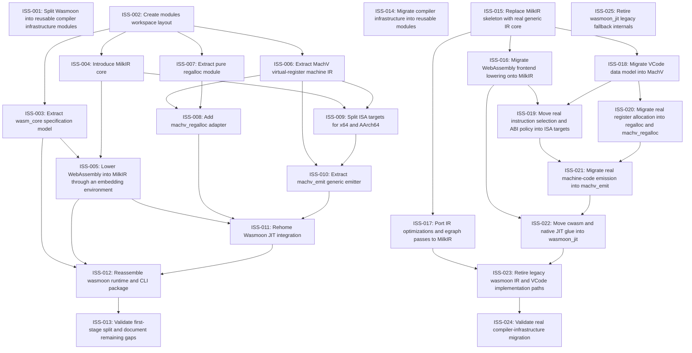

# Markdown Issue Index

Generated by derive-tracker.wasm

## Ready Queue

No ready issues.

## Unresolved Issues

| ID | Status | Priority | Type | Assignee | Blocked by | Blocks | Title |
| --- | --- | ---: | --- | --- | --- | --- | --- |
| [ISS-025](ISS-025.md) | in_progress | 2 | task | unassigned | none | none | Retire wasmoon_jit legacy fallback internals |

## Dependency Graph

## Warnings

None.

